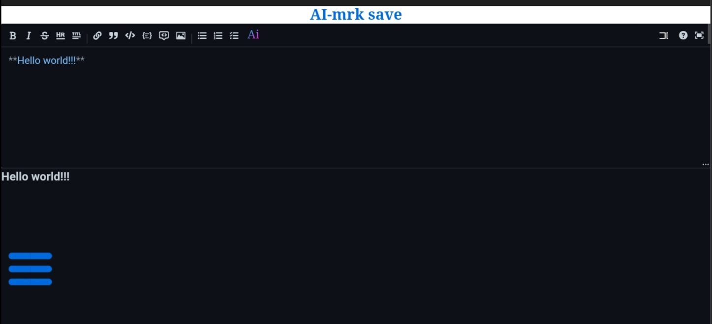
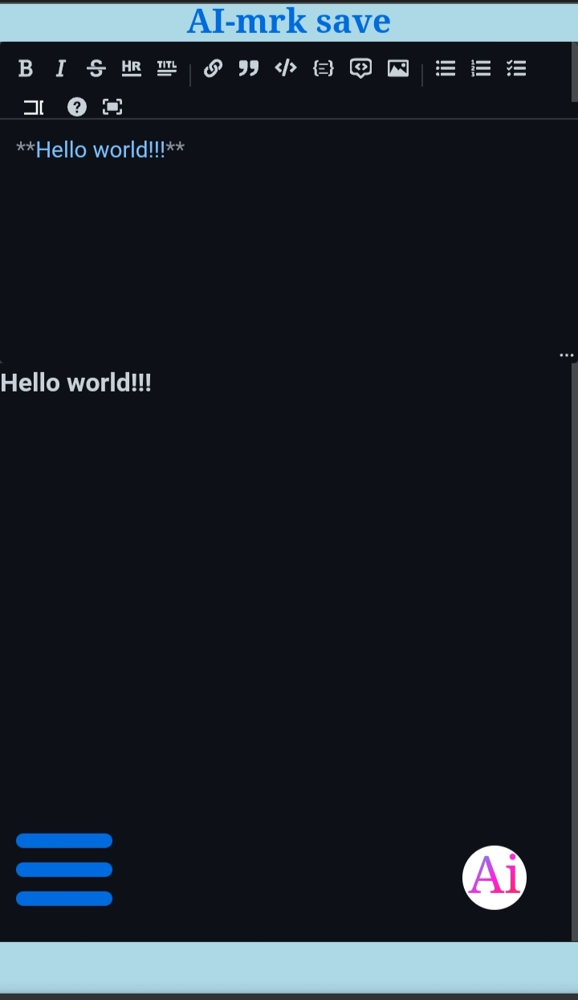
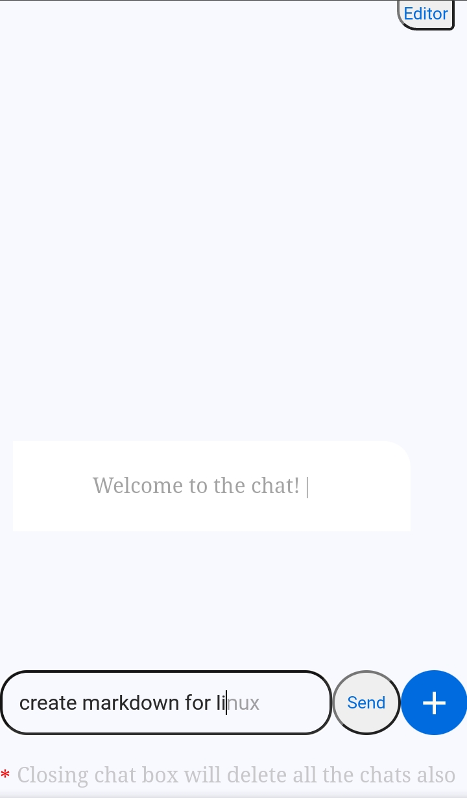
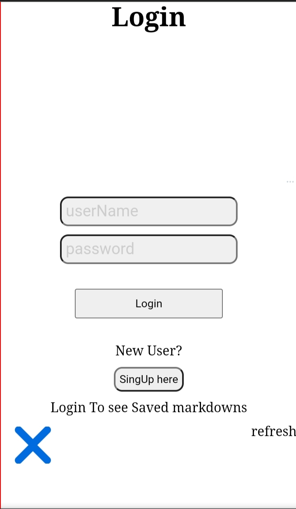

# Ai-mrk(Advanced Intelligent Markdown Resource Kit)
## AI-Powered Markdown Editor

Create, Edit, and Collaborate on Markdown Documents with Ease!

## Features

- **Syntax Highlighting:** Beautifully formatted Markdown with syntax highlighting for code blocks.

- **AI Chatbot:** Generate Markdown content effortlessly with the built-in AI chatbot. Just ask!

- **File Format Support:** Convert PDF, TXT, HTML, or XML files into Markdown.

- **User-Friendly:** Securely create an account, save your Markdown documents in the cloud, and enjoy encrypted user identity.

## Technologies Used

- **Frontend:** React, TypeScript, CSS, Framer Motion, Axios

- **Backend:** Node.js, Express.js, JSON Web Tokens (jsonwebtoken), Mongoose, UUID, Neural Language Model

## Usage

1. Create a new account or log in securely.

2. Use the intuitive Markdown editor with syntax highlighting.

3. Chat with the AI bot to generate Markdown content on any topic.

4. Convert PDF, TXT, HTML, or XML files into Markdown effortlessly.

5. Save your work securely in the cloud.

## Screenshots
### full view

### mobile view

## License

This project is licensed under the [MIT License](LICENSE).

## Contact

- Project Link: [live](https://ai-mrk.onrender.com)

- Contact me: [linkedIn](https://www.linkedin.com/in/ajay-shukla-803308212)

## Acknowledgments

We would like to thank the open-source community and the developers of the technologies that made this project possible.

Enjoy using the AI-Powered Markdown Editor! Feel free to reach out with any questions or feedback.
## by Ajay Shukla